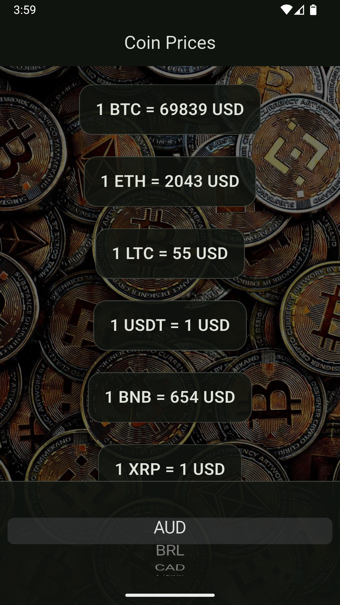
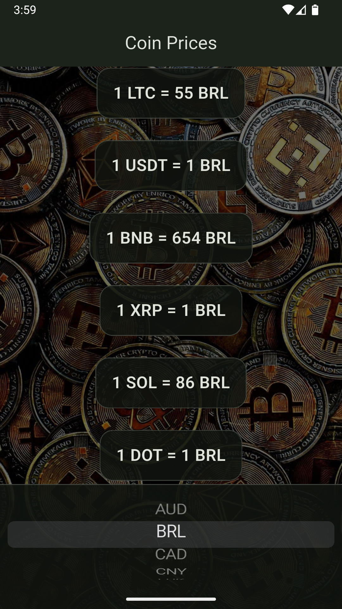
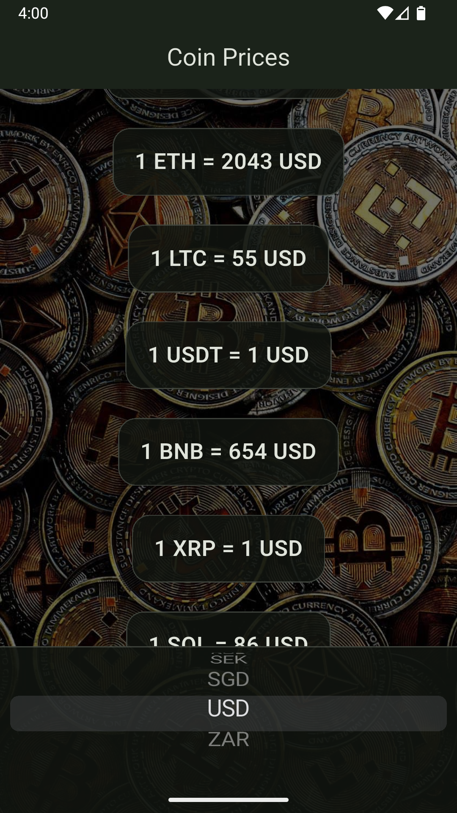

# 💰 Crypto Tracker App (Flutter)


# 📱 Demo
<p align="center">
	
    
    
</p>

A **virtual currency transfer application**, developed in **Flutter**, that allows you to view updated cryptocurrency values ​​in real time, using an external API.

This project is part of my evolution in mobile development, focusing on **API integration, code organization, and Flutter best practices**.

---

## 📱 Features

- 📊 Real-time cryptocurrency price display
- 🔄 Dynamic value updates
- 💱 Virtual currency to fiat currency conversion
- 🌐 REST API consumption
- 📱 Simple and intuitive interface

---

## 🛠️ Technologies Used

- **Flutter**
- **Dart**
- **HTTP**
- **REST API**
- **Asynchronous programming (async/await)**

---

## 📂 Project Structure
 
 ```
 lib/
├── coin_data.dart
├── crypto_card.dart
│── main.dart
└── price_screen.dart
```
